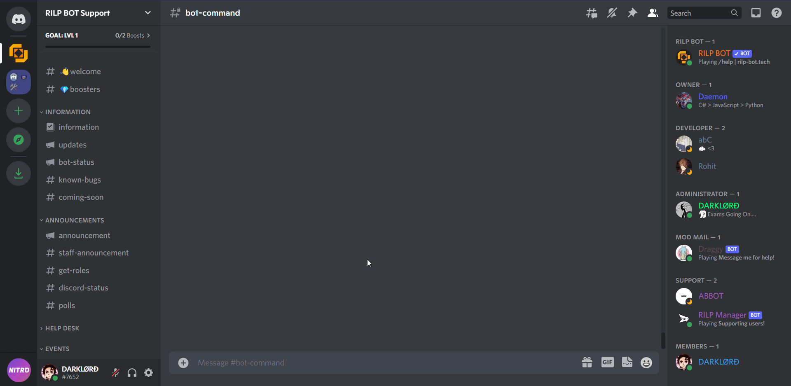

# Basics

## DEVELOPER MODE

Developer mode is one of the most useful feature while playing around bots.\
Enabling it would allow one to copy Server IDs, User IDs, Channel IDs etc.

### But how do I enable it ?

### Copying Server IDs

### Copying Channel IDs

### Copying Message IDs

### Copying User IDs

