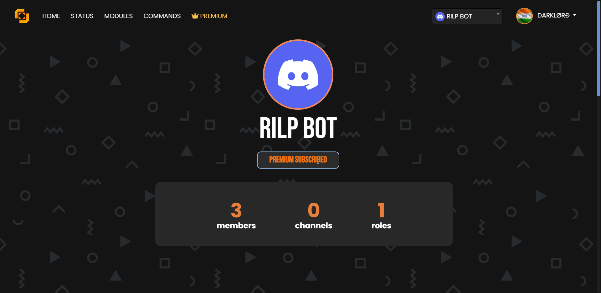

# Custom Commands

### Adding a Custom Command

* The `Delete Command` option if enabled will delete the command used by the user and only leave the bot's reply.
* The `DM Response` option if enabled will Dm the reply to the user using the Custom Command.

### Deleting a Custom Command


You can have 20 custom commands in basic version will unlimited in premium version.

