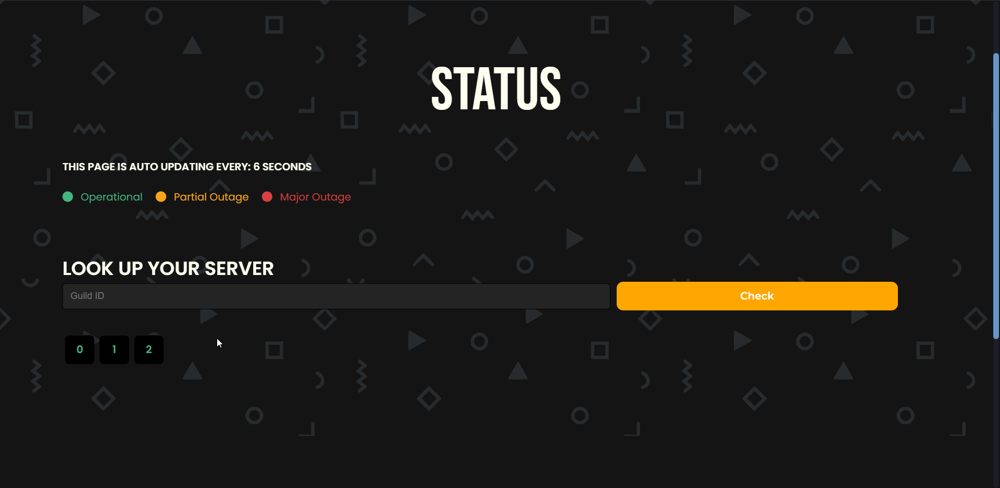

# Status Page

### Status Page allows the user to check the current status of the bot and if it is down in any of the shards

## Where do I find the status page ?

Status Page can be accessed from the [Dashboard](https://rilp-bot.tech) by clicking on "Status" \
or just by directly [Clicking Here](https://rilp-bot.tech/status).



## How do I find my guild on status page ?

On the status page enter you [Guild Id](../getting-started/basics.md#copying-server-ids) in "LOOK UP YOUR SERVER" menu and then click on "Check"\
The shard in which your guild is present will start glowing up \
(in this case Shard 0 )


Note that If the Shard Number is in <mark style="color:green;">Green</mark> color, that means all the servers in that shard are operational with fairly low pings.\
\
If the Shard Number is in <mark style="color:yellow;">Yellow</mark> color, that means some of the servers in that shard are facing ping issues.\
\
If the Shard Number is in <mark style="color:red;">Red</mark> color, that means the bot is down in most/all of the servers in that shard



Hovering on the shard numbers will give more info about them.\
\
The Status Page reloads after every 30seconds automatically.

